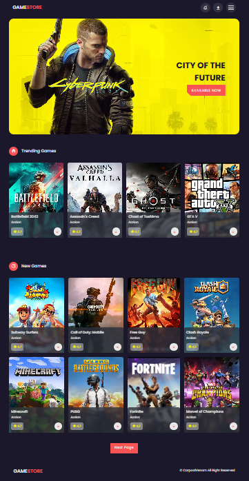
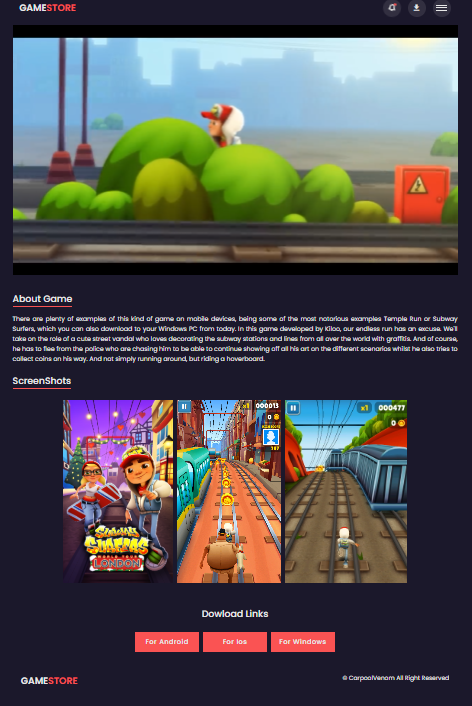

# 🎮 Game Store Website

A simple and modern **Game Store** web project built with **HTML, CSS, and JavaScript**.  
This project simulates a game showcase website with sections for trending, new, and action games — as well as individual download pages for each game.

---

## 🚀 Features

* 🏠 **Home Page** — Modern UI layout with game categories  
* 🎬 **Download Page** — Game trailer video, screenshots, and download links  
* 🌈 **Custom Scroll Bar** — Dynamic scroll progress indicator  
* 📱 **Responsive Design** — Fully optimized for all screen sizes  
* 🔔 **Notification System** — Simple alerts for download actions  
* 🖼️ **Game Cards** — Rating system and quick access to downloads  

---

## 🧰 Technologies Used

* **HTML5** — Semantic structure and markup  
* **CSS3** — Layout, animation, and responsive design  
* **JavaScript (Vanilla JS)** — Scroll bar logic and UI interactivity  
* **Boxicons** — Icon library for UI enhancement  
* **Swiper.js** — (optional if used) For sliders or game showcases  

---

## 📸 Preview
### 🏠 Home Page

### 🎮 Download Page

---

## 🪪 License
This project is open source and available under the [MIT License](LICENSE).

---

## 🧑‍💻 Author
**Mobin Mahmoudzadeh**  
📧 [Mobin.mahmoudzadehhh@gmail.com](mailto:Mobin.mahmoudzadehhh@gmail.com)  
🌐 [GitHub Profile](https://github.com/Mobin-mahmoudzadeh)
